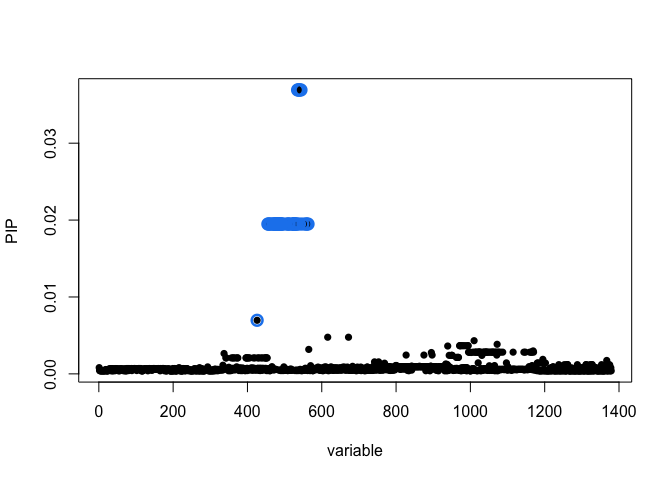

# Variance component analysis


Install the susieR R packages from GitHub:

```r
devtools::install_github("stephenslab/susieR@0.9.0")
```

## Preparing the data

First, we need to import the processed flow cytometry intensity values from the variance compoent analysis tutorial:


```r
intensity_matrix = readRDS("../../results/flow_intensity_matrix.rds")
```

This is what the processed data looks like. Right now, we are only interesed in the fluorescent intensity values for CD14 (column 4).


```r
intensity_matrix
```

```
## # A tibble: 121 x 7
##    line_id genotype_id      flow_date   CD14  CD16 CD206 sample_id        
##    <chr>   <chr>            <date>     <dbl> <dbl> <dbl> <chr>            
##  1 aipt_2  HPSI0513i-aipt_2 2014-06-16 1.71  1.06  2.29  aipt_2_2014-06-16
##  2 aipt_2  HPSI0513i-aipt_2 2014-06-20 1.70  1.20  2.20  aipt_2_2014-06-20
##  3 auim_2  HPSI0613i-auim_2 2014-11-18 0.572 0.252 0.980 auim_2_2014-11-18
##  4 auim_2  HPSI0613i-auim_2 2014-11-21 1.16  0.466 1.74  auim_2_2014-11-21
##  5 babk_2  HPSI1213i-babk_2 2014-12-16 1.19  1.75  1.63  babk_2_2014-12-16
##  6 babk_2  HPSI1213i-babk_2 2015-11-27 0.886 2.01  0.565 babk_2_2015-11-27
##  7 bezi_1  HPSI0114i-bezi_1 2015-07-21 1.34  1.61  1.11  bezi_1_2015-07-21
##  8 bezi_1  HPSI0114i-bezi_1 2015-07-30 1.49  1.45  1.62  bezi_1_2015-07-30
##  9 bezi_1  HPSI0114i-bezi_1 2015-08-05 1.42  1.85  1.47  bezi_1_2015-08-05
## 10 bima_1  HPSI1113i-bima_1 2014-12-16 0.905 0.986 1.53  bima_1_2014-12-16
## # … with 111 more rows
```


Next, we can load the genotype matrix. The genotype data was initially stored in the VCF format and it was converted into an R matrix using the [this script](https://github.com/kauralasoo/flow_cytomtery_genetics/blob/master/analysis/preprocessing/importGenotypes.R).

```r
genotypes = readRDS("../../data/genotypes/open_access_genotypes.rds")
```
The command above loads in a list that has two components. The first one contains the coordinates of the genetic variants:

```r
head(genotypes$snpspos)
```

```
## # A tibble: 6 x 3
##   snpid      chr         pos
##   <chr>      <chr>     <int>
## 1 rs13188297 5     140133794
## 2 rs13156549 5     140135379
## 3 rs269783   5     140135809
## 4 rs156095   5     140137463
## 5 rs185123   5     140137612
## 6 rs156094   5     140137976
```
And the second one is a matrix that contain the genotypes (reference allele dosage) for each variant and cell line. If the reference allele is A and the alternate allele is T then individuals with AA genotype are represented with 2, individuals with AT genotype are represented by 1 and individuals with TT genotype are represented by 0.

```r
genotypes$genotypes[1:5,1:5]
```

```
##            HPSI0114i-bezi_1 HPSI0114i-eipl_1 HPSI0114i-fikt_3
## rs13188297                2                2                2
## rs13156549                2                1                2
## rs269783                  2                2                1
## rs156095                  0                1                1
## rs185123                  0                1                0
##            HPSI0114i-iisa_3 HPSI0114i-joxm_1
## rs13188297                1                2
## rs13156549                1                2
## rs269783                  2                1
## rs156095                  0                1
## rs185123                  0                0
```

```r
dim(genotypes$genotypes)
```

```
## [1] 6022   39
```

Finally, we need to prepare the flow cytometry data for association testing. This involves retaining only one (randomly selected) measurement for each cell line and retaining only cell lines for which open access genotype data is available. Also, we only keep the data for the CD14 protein.


```r
#keep one sample per donor
unique_donor = dplyr::group_by(intensity_matrix, genotype_id) %>%
  dplyr::filter(row_number() == 1) %>% dplyr::ungroup()
flow_matrix = t(unique_donor[,c("CD14","CD16","CD206")])
colnames(flow_matrix) = unique_donor$genotype_id

#Keep only those donors that have open access genotype data
cd14_intensity_vector = flow_matrix["CD14",colnames(genotypes$genotypes)]
cd14_intensity_vector
```

```
## HPSI0114i-bezi_1 HPSI0114i-eipl_1 HPSI0114i-fikt_3 HPSI0114i-iisa_3 
##        1.3439001        0.8069288        1.3536236        1.1410042 
## HPSI0114i-joxm_1 HPSI0114i-lexy_1 HPSI0114i-oevr_3 HPSI0114i-rozh_5 
##        1.0928259        0.8983877        0.9471655        1.0244653 
## HPSI0114i-vabj_3 HPSI0114i-vass_1 HPSI0214i-eiwy_1 HPSI0214i-heja_1 
##        0.9540477        1.0325308        1.0146772        1.0690626 
## HPSI0214i-kehc_2 HPSI0214i-kucg_2 HPSI0214i-pelm_3 HPSI0214i-wibj_2 
##        1.4319598        1.2731634        1.3495593        1.5109548 
## HPSI0314i-bubh_1 HPSI0314i-fafq_1 HPSI0314i-qaqx_1 HPSI0314i-sojd_3 
##        1.4165599        0.4014342        0.9170789        0.9169643 
## HPSI0314i-xugn_1 HPSI0913i-diku_1 HPSI0913i-eika_2 HPSI0913i-oapg_5 
##        1.1905581        1.2056123        0.7946131        1.0234892 
## HPSI1013i-cups_3 HPSI1013i-hiaf_2 HPSI1013i-kuxp_1 HPSI1013i-pamv_3 
##        1.3770164        0.9488344        1.2297837        1.3029604 
## HPSI1013i-sebz_1 HPSI1013i-yemz_1 HPSI1113i-bima_1 HPSI1113i-eofe_1 
##        1.1811835        1.4935914        0.9047927        1.4934246 
## HPSI1113i-hayt_1 HPSI1113i-ieki_2 HPSI1113i-podx_1 HPSI1113i-qolg_3 
##        0.6871537        1.2919655        1.2515995        1.5014157 
## HPSI1213i-babk_2 HPSI1213i-hehd_2 HPSI1213i-pahc_4 
##        1.1911438        1.0774668        1.4558284
```

We also need to filter the genotype data to only keep the genetic variants that are near the CD14 gene (on chromosome 5):


```r
cd14_variants = dplyr::filter(genotypes$snpspos, chr == "5")
cd14_genotypes = genotypes$genotypes[cd14_variants$snpid,names(cd14_intensity_vector)]
cd14_genotypes[1:5,1:5]
```

```
##            HPSI0114i-bezi_1 HPSI0114i-eipl_1 HPSI0114i-fikt_3
## rs13188297                2                2                2
## rs13156549                2                1                2
## rs269783                  2                2                1
## rs156095                  0                1                1
## rs185123                  0                1                0
##            HPSI0114i-iisa_3 HPSI0114i-joxm_1
## rs13188297                1                2
## rs13156549                1                2
## rs269783                  2                1
## rs156095                  0                1
## rs185123                  0                0
```

```r
dim(cd14_genotypes)
```

```
## [1] 1380   39
```

Since one of the variants happens to contain a missing value, me need to exclude this one also (fine mapping will not work otherwise). In a real analysis, we might want to impute this missing genotype.


```r
cd14_genotypes = cd14_genotypes[!(rowSums(is.na(cd14_genotypes)) > 0),]
dim(cd14_genotypes)
```

```
## [1] 1379   39
```

# Statistical fine mapping using SuSiE

First, let's standardise genotypes (subtract mean from each row) and transpose the genotype matrix so that individuals are in rows and genetic variant are in rows.

```r
standard_genotypes = t(cd14_genotypes - apply(cd14_genotypes, 1, mean))
standard_genotypes[1:5,1:5]
```

```
##                   rs13188297 rs13156549   rs269783   rs156095    rs185123
## HPSI0114i-bezi_1  0.05128205  0.3076923  0.3589744 -1.2820513 -0.94871795
## HPSI0114i-eipl_1  0.05128205 -0.6923077  0.3589744 -0.2820513  0.05128205
## HPSI0114i-fikt_3  0.05128205  0.3076923 -0.6410256 -0.2820513 -0.94871795
## HPSI0114i-iisa_3 -0.94871795 -0.6923077  0.3589744 -1.2820513 -0.94871795
## HPSI0114i-joxm_1  0.05128205  0.3076923 -0.6410256 -0.2820513 -0.94871795
```

Now we are ready to perform fine mapping:


```r
fitted <- susieR::susie(standard_genotypes, cd14_intensity_vector,
                          verbose = TRUE,
                          compute_univariate_zscore = TRUE)
```

```
## [1] "objective:4.6503203977023"
## [1] "objective:9.33070272105073"
## [1] "objective:9.90449476338386"
## [1] "objective:9.99254026937473"
## [1] "objective:10.0177854477139"
## [1] "objective:10.0208631909704"
## [1] "objective:10.0285334294403"
## [1] "objective:10.0288555730711"
## [1] "objective:10.0304724613254"
## [1] "objective:10.0305228644133"
## [1] "objective:10.0308374604745"
```

```r
fitted$variant_id = colnames(standard_genotypes)
```

# Extract the variants belonging to the credible set

```r
credible_set = fitted$variant_id[fitted$sets$cs$L1]
credible_set
```

```
##  [1] "rs9688094"  "rs6550"     "rs55720104" "rs17118938" "rs6883156" 
##  [6] "rs4279384"  "rs2878916"  "rs73269505" "rs2569162"  "rs2563320" 
## [11] "rs2569164"  "rs2569165"  "rs2569166"  "rs2569167"  "rs2563321" 
## [16] "rs2569168"  "rs2569169"  "rs2563322"  "rs2563323"  "rs2569170" 
## [21] "rs2563324"  "rs1835148"  "rs2569171"  "rs2569175"  "rs2569177" 
## [26] "rs2569178"  "rs2569179"  "rs778601"   "rs778600"   "rs778599"  
## [31] "rs1991801"  "rs2569185"  "rs778582"   "rs778583"   "rs778585"  
## [36] "rs778586"   "rs778587"   "rs778588"   "rs778589"   "rs2563317" 
## [41] "rs2563316"  "rs2563315"  "rs2563298"  "rs2569192"  "rs2569193" 
## [46] "rs4912717"
```

```r
length(credible_set)
```

```
## [1] 46
```
As we can see, SuSiE finds that with 95% probability, the causal variant is one of these 46 variants, reflecting the high number of genetic variants in high LD with the lead variant that you found in the previous homework.

# Visualise the fine mapping results

Exract SNP positions for the variants included in fine mapping:


```r
pos_tbl = dplyr::tibble(snpid = colnames(standard_genotypes)) %>% dplyr::left_join(genotypes$snpspos)
```

```
## Joining, by = "snpid"
```

Visualise fine mapping results on top of -log10 p-values z-scores from univariate analysis:


```r
susieR::susie_plot(fitted, y = "z", pos = pos_tbl$pos)
```

<!-- -->

Visualise posterior inclusion probability (PIP) for each variant directly


```r
susieR::susie_plot(fitted, y = "PIP", pos = pos_tbl$pos)
```

<!-- -->

Variants included in the credible set are marked with green. Note that none of the PIP values are large, indicating the the model is not confident that any specifc variant in this region is causal, even though the z-scores on the previous plot indicate that tere is a very strong associaton in this region.
