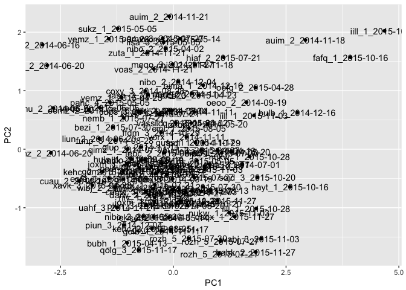
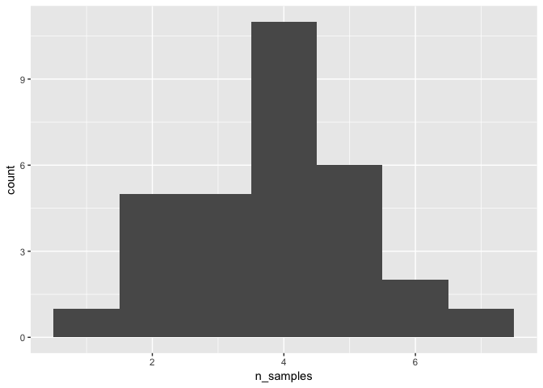
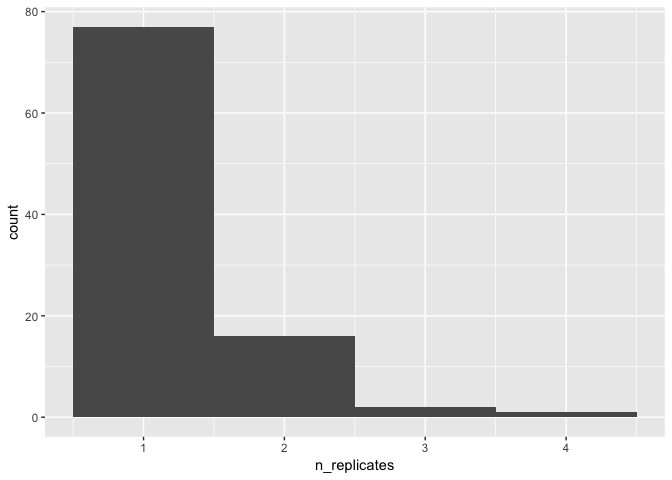
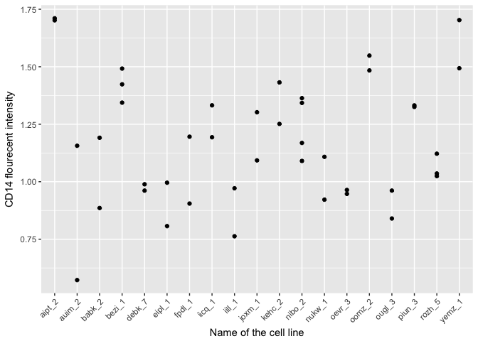
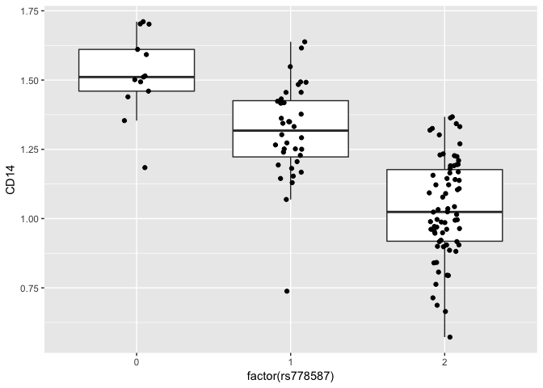

---
title: "Variance component analysis"
output: 
  html_document: 
    keep_md: yes
---

# Variance component analysis


In this tutoral, we are going to used linear mixed models implemented in the lme4 R package to estimate the proportion of variance in the dataset that can be attributed to different experimental and biological factors. More concretely, we want to estimate what has larger effect on CD14 cell surface expression in human iPSC-derived macrophages - the date when the measurement was made or the cell line from which the cells originated? 

First, we need to load some packages that are used in the analysis.

```r
library("lme4")
library("dplyr")
library("tidyr")
library("ggplot2")
```

We also need to define a function that calculates the percentage of variance explained my each term in the linear mixed model. We will use it later:

```r
#' Calculate the proportion of variance explaned by different factors in a lme4 model
varianceExplained <- function(lmer_model){
  variance = as.data.frame(lme4::VarCorr(lmer_model))
  var_percent = dplyr::mutate(variance, percent_variance = vcov/sum(vcov)) %>% 
    dplyr::select(grp, percent_variance) %>% 
    dplyr::mutate(type = "gene")
  var_row = tidyr::spread(var_percent, grp, percent_variance)
  return(var_row)  
}
```

## Preparing the data

First, we need to import the processed data

```r
flow_processed = readRDS("../../results/processed_flow_cytometry_data.rds")
line_medatada = readRDS("../../data/compiled_line_metadata.rds")
```

Next, we can map the flow cytometry channels to the three specfic proteins that were measured in the experiment (CD14, CD16 and CD206)

```r
#Map flow cytometry channels to specifc proteins
channel_marker_map = data_frame(channel = c("APC.A","PE.A","Pacific.Blue.A"), 
                                protein_name = c("CD206","CD16","CD14"))
```

Finally, we can calculate the relative flourecent intensity values for all three proteins in each sample:

```r
#Calculate intensity values
unique_lines = dplyr::select(line_medatada, line_id, donor, genotype_id) %>% unique()
flow_data = dplyr::left_join(flow_processed, channel_marker_map, by = "channel") %>%
  dplyr::mutate(donor = ifelse(donor == "fpdj", "nibo",donor)) %>% #fpdj and nibo are the same donors
  dplyr::left_join(unique_lines, by = "donor") %>%
  dplyr::mutate(intensity = mean2-mean1) %>%
  dplyr::select(line_id, genotype_id, donor, flow_date, protein_name, purity, intensity)

#Construct a matrix of intensity values
intensity_matrix = dplyr::select(flow_data, line_id, genotype_id, flow_date, protein_name, intensity) %>% 
  tidyr::spread(protein_name, intensity) %>%
  dplyr::mutate(sample_id = paste(line_id, as.character(flow_date), sep = "_"))
```

```
## Warning in format.POSIXlt(as.POSIXlt(x), ...): unknown timezone 'zone/tz/
## 2018c.1.0/zoneinfo/Europe/Tallinn'
```

## Detecting outliers
We use principal component analysis to identify potential outlier samples:

```r
#Make a matrix of flow data and perform PCA
flow_matrix = as.matrix(intensity_matrix[,c(4,5,6)])
rownames(flow_matrix) = intensity_matrix$sample_id
pca_res = prcomp(flow_matrix, scale = TRUE, center = TRUE)

#Make a PCA plot
pca_df = dplyr::mutate(as.data.frame(pca_res$x), sample_id = rownames(pca_res$x))
ggplot(pca_df, aes(x = PC1, y = PC2, label = sample_id)) + geom_point() + geom_text()
```

<!-- -->

After closer inspection, it seems that there are two potential outlier samples. Let's remove those. Note that his step is somewhat subjective and you should make sure that you are not unintentionally skewing your results. One option is to rerun your analysis without removing outliers and checking how the results change.

```r
#Choose outliers based on PCA and remove them
outlier_samples = c("fafq_1_2015-10-16","iill_1_2015-10-20")
flow_df_filtered = dplyr::filter(intensity_matrix, !(sample_id %in% outlier_samples))
```

## General properties of the data
###Hown many samples were measured on each date?

```r
date_count = dplyr::group_by(flow_df_filtered, flow_date) %>% 
  dplyr::summarise(n_samples = length(flow_date))
ggplot(date_count, aes(x = n_samples)) + geom_histogram(binwidth = 1)
```

<!-- -->

###What is the number of replicates per cell line?

```r
date_count = dplyr::group_by(flow_df_filtered, line_id) %>% 
  dplyr::summarise(n_replicates = length(line_id))
ggplot(date_count, aes(x = n_replicates)) + geom_histogram(binwidth = 1)
```

<!-- -->

## Visualising sources of variation
First, let's plot the CD14 flourecent intensity according to the date when the meaurement was performed.

```r
ggplot(flow_df_filtered, aes(x = as.factor(flow_date), y = CD14)) + 
  geom_point() + 
  theme(axis.text.x = element_text(angle = 45, hjust = 1)) +
  ylab("CD14 flourecent intensity") +
  xlab("Measurement date")
```

<!-- -->

Now, let's group the samples accoring to the cell line that the come from and redo the plot. To make the plot easier to read, we should first keep only the cell lines that had more than one sample.

```r
replicated_donors = dplyr::group_by(flow_df_filtered, line_id) %>% 
  dplyr::summarise(n_replicates = length(line_id)) %>% 
  dplyr::filter(n_replicates > 1)
flow_df_replicated = dplyr::filter(flow_df_filtered, line_id %in% replicated_donors$line_id)
```

We can now make the same plot, but group the intensities according to the line_id:

```r
ggplot(flow_df_replicated, aes(x = line_id, y = CD14)) + 
  geom_point() + 
  theme(axis.text.x = element_text(angle = 45, hjust = 1)) +
  ylab("CD14 flourecent intensity") +
  xlab("Name of the cell line")
```

<!-- -->

Based on these plots, which one do you think explains more variation in the data - the date of the experiment or the cell line which sample originated from?

## Variance component analysis
Finally, let's use linear mixed model to estimate proportion of variance explained by the date of the experiment (flow_date) and the cell line from which the sample originated (line_id). 

```r
cd14_variance = lmer(CD14 ~ (1|flow_date) + (1|line_id), flow_df_filtered) %>% varianceExplained()
cd14_variance
```

```
##   type flow_date   line_id  Residual
## 1 gene         0 0.6705885 0.3294115
```

For sanity check, we can repeat the same analysis on the the subset of the data in which each line had at least two replicate samples (but some dates now had only a single measurement):

```r
cd14_variance_replicated = lmer(CD14 ~ (1|flow_date) + (1|line_id), flow_df_replicated) %>% varianceExplained()
cd14_variance_replicated
```

```
##   type flow_date   line_id  Residual
## 1 gene         0 0.7351271 0.2648729
```

# Search for genetic variants that might explain donor variation
## Importing genotype data
Observing that 67% of the variance in CD14 cell surface expression can be atributed to differences between cell lines raises an interesting question - are these differences genetic? To check that, we nee to first import the genotype data from these cell lines. To reduce the number of tests that we need to perform, we fill focus on commom genetic variants (minor allelele frequency > 5%) that are located near (<200 kilobases) to the genes coding for the three cell surface proteins (CD14 (CD14), FCGR2A/FCGR2B (CD16) and MRC1 (CD206)).

Next, we can load the genotype matrix. The genotype data was initially stored in the VCF format and it was converted into an R matrix using the [this script](https://github.com/kauralasoo/flow_cytomtery_genetics/blob/master/analysis/preprocessing/importGenotypes.R).

```r
genotypes = readRDS("../../data/genotypes/open_access_genotypes.rds")
```
The command above loads in a list that has two components. The first one contains the coordinates of the genetic variants:

```r
head(genotypes$snpspos)
```

```
## # A tibble: 6 x 3
##   snpid      chr         pos
##   <chr>      <chr>     <int>
## 1 rs13188297 5     140133794
## 2 rs13156549 5     140135379
## 3 rs269783   5     140135809
## 4 rs156095   5     140137463
## 5 rs185123   5     140137612
## 6 rs156094   5     140137976
```
And the second one is a matrix that contain the genotypes (reference allele dosage) for each variant and cell line. If the reference allele is A and the alternate allele is T then individuals with AA genotype are represented with 2, individuals with AT genotype are represented by 1 and individuals with TT genotype are represented by 0.

```r
genotypes$genotypes[1:5,1:5]
```

```
##            HPSI0114i-bezi_1 HPSI0114i-eipl_1 HPSI0114i-fikt_3
## rs13188297                2                2                2
## rs13156549                2                1                2
## rs269783                  2                2                1
## rs156095                  0                1                1
## rs185123                  0                1                0
##            HPSI0114i-iisa_3 HPSI0114i-joxm_1
## rs13188297                1                2
## rs13156549                1                2
## rs269783                  2                1
## rs156095                  0                1
## rs185123                  0                0
```

```r
dim(genotypes$genotypes)
```

```
## [1] 6022   39
```

The genotype matrix contains data for 6022 variants in 39 cell lines. Although the genotype data for other cell lines is also available, it is not open access and cannot therefore be shared publicly.

## Testing for genetic associations
In the simplest scenario, testing for associations between genetic variants and a phenotype of interest (e.g. CD14 cell surface expression) is performed using linear regression. In R, this is usually done using the built in `lm` function. Although very powerful, `lm` can be prohibitively slow when we need to tests associations betweeb thousands of phenotypes (all expressed genes) and million of genetic variants. [MatrixEQTL](http://www.bios.unc.edu/research/genomic_software/Matrix_eQTL/) package has been developed to make these tests much faster. We first need to load the MatrixEQTL package and a conveniance wrapper function that I have a written myself.


```r
library("MatrixEQTL")
source("../../analysis/functions/MatrixEQTL_wrapper.R")
```

Next, we need to define the genomic goordinates of the genes that code the CD14, CD16 and CD206 proteins:

```r
gene_pos = data_frame(geneid = c("CD14", "CD16", "CD206"), chr = c("5","1","10"), left = c(140631728,161505430,17809344), right = c(140633701,161678654,17911170))
gene_pos
```

```
## # A tibble: 3 x 4
##   geneid chr         left      right
##   <chr>  <chr>      <dbl>      <dbl>
## 1 CD14   5     140631728. 140633701.
## 2 CD16   1     161505430. 161678654.
## 3 CD206  10     17809344.  17911170.
```

Finally, we need to prepare the flow cytometry data for association testing. This involves retaining only one (randomly selected) measurement for each cell line and retaining only cell lines for which open access genotype data is available.

```r
#keep one sample per donor
unique_donor = dplyr::group_by(intensity_matrix, genotype_id) %>%
  dplyr::filter(row_number() == 1) %>% dplyr::ungroup()
flow_matrix = t(unique_donor[,c("CD14","CD16","CD206")])
colnames(flow_matrix) = unique_donor$genotype_id

#Keep only those donors that have open access genotype data
flow_matrix = flow_matrix[,colnames(genotypes$genotypes)]
```

With all of the data in place, we can finally run MatrixEQTL:

```r
results = runMatrixEQTL(flow_matrix, genotypes$genotypes, as.data.frame(genotypes$snpspos),
                        as.data.frame(gene_pos), covariates = NULL, 
                        cisDist = 2e5, pvOutputThreshold = 1, permute = FALSE, model = modelLINEAR)
```

## Visualising genetic associations

One way to visualise genetic associations is to use the Manhattan plot where the position of the genetic variant is on the x-axis and the -log10 association p-value between the genetic variant and the phenotype (e.g. CD14 fluorescent intensity) is on the y-axis To do this, we firs need to add variant coordinates to the MatrixEQTL results table and filter the CD14 results:

```r
  cd14_variants = dplyr::left_join(results$cis$eqtls, genotypes$snpspos, by = c("snps" = "snpid")) %>%
  dplyr::filter(gene == "CD14")
```

```
## Warning: Column `snps`/`snpid` joining factor and character vector,
## coercing into character vector
```

Next, we can use ggplot2 to make the draw the Manhattan plot:

```r
ggplot(cd14_variants, aes(x = pos, y = -log(pvalue, 10))) + geom_point()
```

<!-- -->

We can also see that the variant with the smallest association p-values is rs778587 (although because of linkage disequilibrium, four other variants have exactly the same p-value):

```r
head(cd14_variants)
```

```
##        snps gene statistic       pvalue          FDR       beta chr
## 1  rs778587 CD14 -7.425127 7.750138e-09 1.097356e-06 -0.2877314   5
## 2  rs778588 CD14 -7.425127 7.750138e-09 1.097356e-06 -0.2877314   5
## 3  rs778589 CD14 -7.425127 7.750138e-09 1.097356e-06 -0.2877314   5
## 4 rs2563316 CD14 -7.425127 7.750138e-09 1.097356e-06 -0.2877314   5
## 5 rs2563315 CD14 -7.425127 7.750138e-09 1.097356e-06 -0.2877314   5
## 6    rs6550 CD14 -7.145753 1.814144e-08 1.097356e-06 -0.2824109   5
##         pos
## 1 140626845
## 2 140627426
## 3 140628053
## 4 140628226
## 5 140628920
## 6 140569031
```

# Revisiting variance compoent analysis
Finally, we can check how incopororating the most associated genetic variant into the variance component analysis changes the results. Although the full genotype data is publicly available for only subset of the donors, we have added the genotypes of the lead CD14 variant (rs778587) for all of the donors into GitHub. First, let's import the genotypes and add them to the to flow dataset:


```r
cd14_lead_variant = read.table("../../data/genotypes/cd14_lead_variant.txt", header = TRUE, stringsAsFactors = FALSE)
flow_df_genotype = dplyr::left_join(flow_df_filtered, cd14_lead_variant, by = "genotype_id")
```

Now, we can redo the variance component analysis and ask how much of the cell line specific variaition can be explained by the genetic variant that was most associated with CD14 expression.

```r
cd14_variance = lmer(CD14 ~ (1|flow_date) + (1|line_id) + (1|rs778587), flow_df_genotype) %>% varianceExplained()
cd14_variance
```

```
##   type   flow_date   line_id  Residual  rs778587
## 1 gene 6.98326e-16 0.1237591 0.2285762 0.6476647
```

As we can see, most of the variance previously atributed to cell line is now explained by the genotype of the rs778587 varaint. We can also directly plot CD14 expression against the genotype of the rs778587 variant:

```r
ggplot(flow_df_genotype, aes(x = factor(rs778587), y = CD14)) + 
  geom_boxplot(outlier.shape = NA) + 
  geom_point(position = position_jitter(width = 0.1, height = 0))
```

<!-- -->

To make sure that this result is specific to CD14, we can also repeat the variance component analysis for CD16 and CD206:

```r
lmer(CD16 ~ (1|flow_date) + (1|line_id) + (1|rs778587), flow_df_genotype) %>% varianceExplained()
```

```
##   type flow_date   line_id  Residual    rs778587
## 1 gene         0 0.5089528 0.4910472 3.43899e-18
```

```r
lmer(CD206 ~ (1|flow_date) + (1|line_id) + (1|rs778587), flow_df_genotype) %>% varianceExplained()
```

```
##   type flow_date    line_id  Residual   rs778587
## 1 gene 0.6391784 0.08510514 0.2600464 0.01567014
```
As expected, the rs778587 variant near the CD14 gene does not explain any variation in the cell surface expression of CD16 and CD206 proteins.
