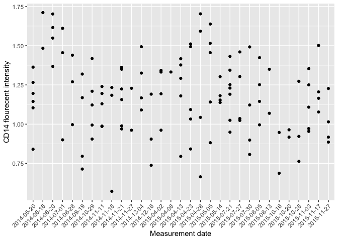
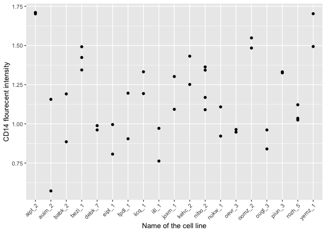
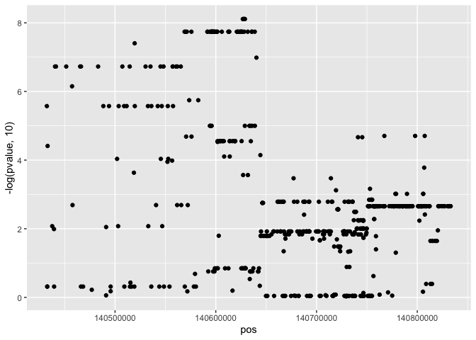
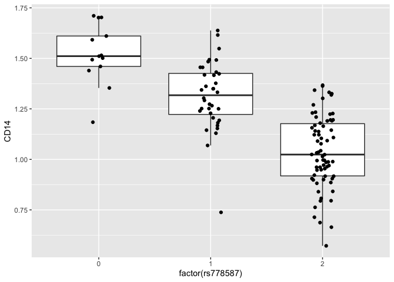

# Variance component analysis


In this tutoral, we are going to use linear mixed model (aka hierarchical model) implemented in the lme4 R package to estimate the proportion of variance in a dataset that can be attributed to different experimental and biological factors. More concretely, we want to estimate which has larger effect on CD14 protein cell surface expression in human iPSC-derived macrophages - the date when the measurement was made or the cell line which the cells originated from? 

First, we need to load the packages that are used in the analysis.

```r
library("lme4")
library("dplyr")
library("tidyr")
library("ggplot2")
library("MatrixEQTL")
```

We also need to define a function that calculates the percentage of variance explained by each term in the linear mixed model. We will use it later:

```r
# Calculate the proportion of variance explaned by different factors in a lme4 model
varianceExplained <- function(lmer_model){
  variance = as.data.frame(lme4::VarCorr(lmer_model))
  var_percent = dplyr::mutate(variance, percent_variance = vcov/sum(vcov)) %>% 
    dplyr::select(grp, percent_variance) %>% 
    dplyr::mutate(type = "gene")
  var_row = tidyr::spread(var_percent, grp, percent_variance)
  return(var_row)  
}
```

## Preparing the data

First, we need to import the processed data

```r
flow_processed = readRDS("../../results/processed_flow_cytometry_data.rds")
line_medatada = readRDS("../../data/compiled_line_metadata.rds")
```

Next, we can map the flow cytometry channels to the three proteins that were measured in the experiment (CD14, CD16 and CD206)

```r
#Map flow cytometry channels to specifc proteins
channel_marker_map = data_frame(channel = c("APC.A","PE.A","Pacific.Blue.A"), 
                                protein_name = c("CD206","CD16","CD14"))
```

```
## Warning: `data_frame()` is deprecated, use `tibble()`.
## This warning is displayed once per session.
```

Finally, we can calculate the relative flourecent intensity values for all three proteins in each sample:

```r
#Calculate intensity values
unique_lines = dplyr::select(line_medatada, line_id, donor, genotype_id) %>% unique()
flow_data = dplyr::left_join(flow_processed, channel_marker_map, by = "channel") %>%
  dplyr::mutate(donor = ifelse(donor == "fpdj", "nibo",donor)) %>% #fpdj and nibo are the same donors
  dplyr::left_join(unique_lines, by = "donor") %>%
  dplyr::mutate(intensity = mean2-mean1) %>%
  dplyr::select(line_id, genotype_id, donor, flow_date, protein_name, purity, intensity)

#Construct a matrix of intensity values
intensity_matrix = dplyr::select(flow_data, line_id, genotype_id, flow_date, protein_name, intensity) %>% 
  tidyr::spread(protein_name, intensity) %>%
  dplyr::mutate(sample_id = paste(line_id, as.character(flow_date), sep = "_"))
```

This is what the processed data looks like:

```r
intensity_matrix
```

```
## # A tibble: 121 x 7
##    line_id genotype_id      flow_date   CD14  CD16 CD206 sample_id        
##    <chr>   <chr>            <date>     <dbl> <dbl> <dbl> <chr>            
##  1 aipt_2  HPSI0513i-aipt_2 2014-06-16 1.71  1.06  2.29  aipt_2_2014-06-16
##  2 aipt_2  HPSI0513i-aipt_2 2014-06-20 1.70  1.20  2.20  aipt_2_2014-06-20
##  3 auim_2  HPSI0613i-auim_2 2014-11-18 0.572 0.252 0.980 auim_2_2014-11-18
##  4 auim_2  HPSI0613i-auim_2 2014-11-21 1.16  0.466 1.74  auim_2_2014-11-21
##  5 babk_2  HPSI1213i-babk_2 2014-12-16 1.19  1.75  1.63  babk_2_2014-12-16
##  6 babk_2  HPSI1213i-babk_2 2015-11-27 0.886 2.01  0.565 babk_2_2015-11-27
##  7 bezi_1  HPSI0114i-bezi_1 2015-07-21 1.34  1.61  1.11  bezi_1_2015-07-21
##  8 bezi_1  HPSI0114i-bezi_1 2015-07-30 1.49  1.45  1.62  bezi_1_2015-07-30
##  9 bezi_1  HPSI0114i-bezi_1 2015-08-05 1.42  1.85  1.47  bezi_1_2015-08-05
## 10 bima_1  HPSI1113i-bima_1 2014-12-16 0.905 0.986 1.53  bima_1_2014-12-16
## # … with 111 more rows
```

## Detecting outliers
We can use principal component analysis to identify potential outlier samples:

```r
#Make a matrix of flow data and perform PCA
flow_matrix = as.matrix(intensity_matrix[,c(4,5,6)])
rownames(flow_matrix) = intensity_matrix$sample_id
pca_res = prcomp(flow_matrix, scale = TRUE, center = TRUE)

#Make a PCA plot
pca_df = dplyr::mutate(as.data.frame(pca_res$x), sample_id = rownames(pca_res$x))
ggplot(pca_df, aes(x = PC1, y = PC2, label = sample_id)) + geom_point() + geom_text()
```

<!-- -->

After closer inspection, it seems that there are two potential outliers. Let's remove those. Note that this step is somewhat subjective and you should make sure that you are not unintentionally skewing your results. One option is to re-run your analysis without removing outliers and checking how the results change.

```r
#Choose outliers based on PCA and remove them
outlier_samples = c("fafq_1_2015-10-16","iill_1_2015-10-20")
flow_df_filtered = dplyr::filter(intensity_matrix, !(sample_id %in% outlier_samples)) %>%
  dplyr::mutate(flow_date = as.factor(flow_date))
```

## General properties of the data
### Hown many samples were measured on each date?

```r
date_count = dplyr::group_by(flow_df_filtered, flow_date) %>% 
  dplyr::summarise(n_samples = length(flow_date))
ggplot(date_count, aes(x = n_samples)) + geom_histogram(binwidth = 1)
```

<!-- -->

### What is the number of replicates per cell line?

```r
replicates_count = dplyr::group_by(flow_df_filtered, line_id) %>% 
  dplyr::summarise(n_replicates = length(line_id))
ggplot(replicates_count, aes(x = n_replicates)) + geom_histogram(binwidth = 1)
```

<!-- -->

## Visualising sources of variation
First, let's plot the CD14 flourecent intensity according to the date when the meaurement was performed.

```r
ggplot(flow_df_filtered, aes(x = as.factor(flow_date), y = CD14)) + 
  geom_point() + 
  theme(axis.text.x = element_text(angle = 45, hjust = 1)) +
  ylab("CD14 flourecent intensity") +
  xlab("Measurement date")
```

<!-- -->

Now, let's group the samples accoring to the cell line (line_id) that they come from and redo the plot.

```r
ggplot(flow_df_filtered, aes(x = line_id, y = CD14)) + 
  geom_point() + 
  theme(axis.text.x = element_text(angle = 45, hjust = 1)) +
  ylab("CD14 flourecent intensity") +
  xlab("Name of the cell line")
```

<!-- -->

To make the plot a bit easier to read, we can keep only the cell lines that were measured more than once.

```r
replicated_donors = dplyr::group_by(flow_df_filtered, line_id) %>% 
  dplyr::summarise(n_replicates = length(line_id)) %>% 
  dplyr::filter(n_replicates > 1)
flow_df_replicated = dplyr::filter(flow_df_filtered, line_id %in% replicated_donors$line_id)
```

Now, we can  redo the same plot again:

```r
ggplot(flow_df_replicated, aes(x = line_id, y = CD14)) + 
  geom_point() + 
  theme(axis.text.x = element_text(angle = 45, hjust = 1)) +
  ylab("CD14 flourecent intensity") +
  xlab("Name of the cell line")
```

<!-- -->

Based on these plots, which one do you think explains more variation in the data - the date of the experiment or the cell line of origin? To me it seems that although the variation between dates seems to be mostly random, there's a clear pattern that multiple samples from the same cell line seem to be more similar to each other than two random samples from two different cell lines. In the following section we will tests this using statistical models.

## Variance component analysis
Finally, let's use linear mixed model to estimate proportion of variance explained by the date of the experiment (flow_date) and the cell line of origin (line_id). 

```r
cd14_variance = lmer(CD14 ~ (1|flow_date) + (1|line_id), flow_df_filtered) %>% varianceExplained()
```

```
## boundary (singular) fit: see ?isSingular
```

```r
cd14_variance
```

```
##   type    flow_date   line_id  Residual
## 1 gene 3.766647e-10 0.6705887 0.3294113
```

For sanity check, we can repeat the same analysis on the the subset of the data in which each line had at least two replicate samples (but some dates now had only a single measurement):

```r
cd14_variance_replicated = lmer(CD14 ~ (1|flow_date) + (1|line_id), flow_df_replicated) %>% varianceExplained()
```

```
## boundary (singular) fit: see ?isSingular
```

```r
cd14_variance_replicated
```

```
##   type    flow_date   line_id  Residual
## 1 gene 3.460558e-11 0.7351268 0.2648732
```

Variance explained by date only

```r
cd14_variance = lmer(CD14 ~ (1|flow_date), flow_df_filtered) %>% varianceExplained()
cd14_variance
```

```
##   type  flow_date  Residual
## 1 gene 0.04897614 0.9510239
```
 
#Do we get similar estimates from the linear model?
Effect of the cell line only

```r
lm_model = lm(CD14 ~ line_id, flow_df_filtered)
summary(lm_model)$adj.r.squared
```

```
## [1] 0.6609108
```

Effect of the experiment date only

```r
lm_model = lm(CD14 ~ flow_date, flow_df_filtered)
summary(lm_model)$adj.r.squared
```

```
## [1] 0.09972803
```

Both effecs in the same model.

```r
lm_model = lm(CD14 ~ flow_date + line_id, flow_df_filtered)
summary(lm_model)
```

```
## 
## Call:
## lm(formula = CD14 ~ flow_date + line_id, data = flow_df_filtered)
## 
## Residuals:
##      Min       1Q   Median       3Q      Max 
## -0.09871  0.00000  0.00000  0.00000  0.09871 
## 
## Coefficients: (14 not defined because of singularities)
##                      Estimate Std. Error t value Pr(>|t|)    
## (Intercept)          1.394067   0.123848  11.256 9.76e-06 ***
## flow_date2014-06-16  0.298347   0.153477   1.944 0.092997 .  
## flow_date2014-06-20  0.326116   0.153477   2.125 0.071210 .  
## flow_date2014-07-01 -0.494140   0.162155  -3.047 0.018653 *  
## flow_date2014-08-28 -0.397296   0.162155  -2.450 0.044101 *  
## flow_date2014-09-19 -0.140487   0.137805  -1.019 0.341920    
## flow_date2014-10-29 -0.290800   0.148027  -1.965 0.090218 .  
## flow_date2014-11-11 -0.408534   0.162155  -2.519 0.039845 *  
## flow_date2014-11-18 -0.616262   0.219559  -2.807 0.026266 *  
## flow_date2014-11-21 -0.032111   0.162155  -0.198 0.848650    
## flow_date2014-11-27 -0.059701   0.219559  -0.272 0.793535    
## flow_date2014-12-04 -0.143733   0.120863  -1.189 0.273123    
## flow_date2014-12-16  0.138446   0.219559   0.631 0.548350    
## flow_date2015-04-02  0.012882   0.101122   0.127 0.902216    
## flow_date2015-04-08  0.151701   0.179269   0.846 0.425409    
## flow_date2015-04-13 -0.214436   0.162155  -1.322 0.227599    
## flow_date2015-04-23  0.099524   0.162155   0.614 0.558783    
## flow_date2015-04-28  0.308792   0.162155   1.904 0.098581 .  
## flow_date2015-05-05  0.244008   0.162155   1.505 0.176095    
## flow_date2015-05-14  0.308870   0.219559   1.407 0.202306    
## flow_date2015-07-21 -0.203509   0.162155  -1.255 0.249745    
## flow_date2015-07-27 -0.228786   0.211942  -1.079 0.316160    
## flow_date2015-07-30 -0.179179   0.187241  -0.957 0.370470    
## flow_date2015-08-05 -0.186660   0.187241  -0.997 0.352019    
## flow_date2015-08-13 -0.044508   0.162155  -0.274 0.791643    
## flow_date2015-10-16 -0.493938   0.219559  -2.250 0.059226 .  
## flow_date2015-10-20 -0.477103   0.162155  -2.942 0.021644 *  
## flow_date2015-10-28 -0.637533   0.193003  -3.303 0.013063 *  
## flow_date2015-11-03 -0.440019   0.162155  -2.714 0.030044 *  
## flow_date2015-11-17  0.107349   0.162155   0.662 0.529147    
## flow_date2015-11-27 -0.167014   0.162155  -1.030 0.337293    
## line_idauim_2       -0.205606   0.148027  -1.389 0.207424    
## line_idbabk_2       -0.341369   0.148027  -2.306 0.054496 .  
## line_idbezi_1        0.215524   0.132399   1.628 0.147584    
## line_idbima_1       -0.627720   0.209341  -2.999 0.019983 *  
## line_idbubh_1        0.236929   0.148027   1.601 0.153503    
## line_idbulb_1       -0.794570   0.209341  -3.796 0.006754 ** 
## line_idcehw_3        0.455752   0.209341   2.177 0.065925 .  
## line_idcicb_3       -0.651882   0.148027  -4.404 0.003142 ** 
## line_idcoio_2        0.406269   0.209341   1.941 0.093439 .  
## line_idcoxy_3        0.273132   0.148027   1.845 0.107529    
## line_idcoyi_3        0.296315   0.148027   2.002 0.085396 .  
## line_idcuau_2        0.315008   0.219559   1.435 0.194493    
## line_idcups_3        0.197386   0.148027   1.333 0.224140    
## line_iddarw_2       -0.109097   0.219559  -0.497 0.634488    
## line_iddebk_7       -0.373033   0.148027  -2.520 0.039808 *  
## line_iddiku_1       -0.295803   0.148027  -1.998 0.085833 .  
## line_ideika_2       -0.385018   0.148027  -2.601 0.035374 *  
## line_ideipl_1       -0.309837   0.151682  -2.043 0.080396 .  
## line_ideiwy_1       -0.212375   0.148027  -1.435 0.194499    
## line_ideofe_1        0.243091   0.137805   1.764 0.121090    
## line_ideojr_3       -0.756343   0.148027  -5.110 0.001385 ** 
## line_ideuir_2       -0.082872   0.137805  -0.601 0.566553    
## line_idfebc_2       -0.062630   0.175148  -0.358 0.731195    
## line_idffdk_1       -0.249317   0.162155  -1.538 0.168051    
## line_idffdm_3        0.018710   0.219559   0.085 0.934477    
## line_idfikt_3        0.399576   0.148027   2.699 0.030668 *  
## line_idfpdl_1       -0.198293   0.162155  -1.223 0.260952    
## line_idfunp_3        0.442713   0.148027   2.991 0.020204 *  
## line_idgedo_3       -0.539702   0.179269  -3.011 0.019646 *  
## line_idgiuo_4        0.254176   0.148027   1.717 0.129664    
## line_idgolb_1        0.209631   0.148027   1.416 0.199649    
## line_idgomv_3        0.106272   0.219559   0.484 0.643142    
## line_idguss_1       -0.336727   0.148027  -2.275 0.057074 .  
## line_idhayt_1       -0.212976   0.209341  -1.017 0.342849    
## line_idhehd_2       -0.423949   0.148027  -2.864 0.024199 *  
## line_idheja_1       -0.280497   0.148027  -1.895 0.099952 .  
## line_idhiaf_2       -0.241724   0.148027  -1.633 0.146493    
## line_idhikj_1        0.555622   0.148027   3.754 0.007135 ** 
## line_idhuls_1        0.065530   0.179269   0.366 0.725506    
## line_idiasn_3       -0.128138   0.162155  -0.790 0.455332    
## line_idieki_2        0.112335   0.148027   0.759 0.472697    
## line_idiicq_1       -0.213557   0.137805  -1.550 0.165146    
## line_idiill_1        0.011851   0.138466   0.086 0.934191    
## line_idiisa_3       -0.497071   0.148027  -3.358 0.012118 *  
## line_idjoxm_1       -0.400766   0.148027  -2.707 0.030313 *  
## line_idkaks_3        0.002005   0.148027   0.014 0.989569    
## line_idkehc_2        0.142694   0.136474   1.046 0.330511    
## line_idkucg_2        0.516629   0.181295   2.850 0.024700 *  
## line_idkuxp_1        0.039226   0.148027   0.265 0.798651    
## line_idlexy_1       -0.316501   0.175148  -1.807 0.113705    
## line_idliun_2       -0.352780   0.138466  -2.548 0.038228 *  
## line_idmeqo_3       -0.106071   0.209341  -0.507 0.627941    
## line_idmijn_2       -0.565032   0.209341  -2.699 0.030679 *  
## line_idnemb_1        0.294806   0.201338   1.464 0.186543    
## line_idnibo_2       -0.084959   0.101122  -0.840 0.428574    
## line_idnukw_1        0.159749   0.138466   1.154 0.286487    
## line_idoapg_5       -0.141791   0.201338  -0.704 0.504028    
## line_idoarz_2        0.144247   0.148027   0.974 0.362290    
## line_idoefg_2       -1.038232   0.148027  -7.014 0.000209 ***
## line_idoeoo_2       -0.458053   0.179269  -2.555 0.037820 *  
## line_idoevr_3        0.047036   0.148027   0.318 0.759940    
## line_idoomz_2       -0.190116   0.104671  -1.816 0.112171    
## line_idougl_3       -0.499795   0.120863  -4.135 0.004375 ** 
## line_idpahc_4       -0.182247   0.148027  -1.231 0.258014    
## line_idpamv_3        0.137680   0.201338   0.684 0.516077    
## line_idpelm_3              NA         NA      NA       NA    
## line_idpeop_2       -0.289904   0.162155  -1.788 0.116950    
## line_idpiun_3              NA         NA      NA       NA    
## line_idpodx_1        0.061041   0.148027   0.412 0.692407    
## line_idqanu_2       -0.104553   0.138466  -0.755 0.474835    
## line_idqaqx_1       -0.309974   0.148027  -2.094 0.074524 .  
## line_idqimz_1        0.710672   0.148027   4.801 0.001964 ** 
## line_idqolg_3              NA         NA      NA       NA    
## line_idriiv_1       -0.137972   0.148027  -0.932 0.382321    
## line_idrozh_5       -0.129568   0.136474  -0.949 0.374036    
## line_idruyv_1       -0.659765   0.148027  -4.457 0.002946 ** 
## line_idsebz_1       -0.521754   0.209341  -2.492 0.041453 *  
## line_idsojd_3              NA         NA      NA       NA    
## line_idsukz_1       -0.123138   0.148027  -0.832 0.432945    
## line_iduahf_3       -0.012003   0.148027  -0.081 0.937643    
## line_iduimo_1              NA         NA      NA       NA    
## line_idvabj_3              NA         NA      NA       NA    
## line_idvass_1       -0.461061   0.148027  -3.115 0.016969 *  
## line_idveqz_6              NA         NA      NA       NA    
## line_idvoas_2       -0.392584   0.148027  -2.652 0.032841 *  
## line_idvorx_1              NA         NA      NA       NA    
## line_idwibj_2        0.017363   0.148027   0.117 0.909918    
## line_idxavk_3       -0.110753   0.148027  -0.748 0.478722    
## line_idxucm_3       -0.549645   0.209341  -2.626 0.034131 *  
## line_idxugn_1              NA         NA      NA       NA    
## line_idyemz_1              NA         NA      NA       NA    
## line_idyuze_1              NA         NA      NA       NA    
## line_idzaui_3              NA         NA      NA       NA    
## line_idzisa_3              NA         NA      NA       NA    
## line_idzuta_1              NA         NA      NA       NA    
## ---
## Signif. codes:  0 '***' 0.001 '**' 0.01 '*' 0.05 '.' 0.1 ' ' 1
## 
## Residual standard error: 0.1047 on 7 degrees of freedom
## Multiple R-squared:  0.9891,	Adjusted R-squared:  0.8167 
## F-statistic: 5.737 on 111 and 7 DF,  p-value: 0.01004
```
Note that in this case many of the parameters estimates are NAs, because the full model actually has more parameters than there are samples and so all of them cannot be estimated at the same time.

# Search for genetic variants that might explain donor variation
## Importing genotype data
Observing that 67% of the variance in CD14 cell surface expression can be atributed to differences between cell lines raises an interesting question - are these differences genetic? To test that, we nee to first import the genotype data from these cell lines. To reduce the number of tests that we need to perform, we fill focus on commom genetic variants (minor allelele frequency > 5%) that are located near (<200 kilobases) to the genes coding for the three cell surface proteins (CD14 (CD14), FCGR2A/FCGR2B (CD16) and MRC1 (CD206)).

Next, we can load the genotype matrix. The genotype data was initially stored in the VCF format and it was converted into an R matrix using the [this script](https://github.com/kauralasoo/flow_cytomtery_genetics/blob/master/analysis/preprocessing/importGenotypes.R).

```r
genotypes = readRDS("../../data/genotypes/open_access_genotypes.rds")
```
The command above loads in a list that has two components. The first one contains the coordinates of the genetic variants:

```r
head(genotypes$snpspos)
```

```
## # A tibble: 6 x 3
##   snpid      chr         pos
##   <chr>      <chr>     <int>
## 1 rs13188297 5     140133794
## 2 rs13156549 5     140135379
## 3 rs269783   5     140135809
## 4 rs156095   5     140137463
## 5 rs185123   5     140137612
## 6 rs156094   5     140137976
```
And the second one is a matrix that contain the genotypes (reference allele dosage) for each variant and cell line. If the reference allele is A and the alternate allele is T then individuals with AA genotype are represented with 2, individuals with AT genotype are represented by 1 and individuals with TT genotype are represented by 0.

```r
genotypes$genotypes[1:5,1:5]
```

```
##            HPSI0114i-bezi_1 HPSI0114i-eipl_1 HPSI0114i-fikt_3
## rs13188297                2                2                2
## rs13156549                2                1                2
## rs269783                  2                2                1
## rs156095                  0                1                1
## rs185123                  0                1                0
##            HPSI0114i-iisa_3 HPSI0114i-joxm_1
## rs13188297                1                2
## rs13156549                1                2
## rs269783                  2                1
## rs156095                  0                1
## rs185123                  0                0
```

```r
dim(genotypes$genotypes)
```

```
## [1] 6022   39
```

The genotype matrix contains data for 6022 variants in 39 cell lines. Although the genotype data for other cell lines is also available, it is not open access and cannot therefore be shared publicly.

## Testing for genetic associations
In the simplest scenario, testing for associations between genetic variants and a phenotype of interest (e.g. CD14 cell surface expression) is performed using linear regression. In R, this is usually done using the built in `lm` function. Although very powerful, `lm` can be prohibitively slow when we need to test associations between thousands of phenotypes (all expressed genes) and millions of genetic variants. [MatrixEQTL](http://www.bios.unc.edu/research/genomic_software/Matrix_eQTL/) package has been developed to make these tests much faster. We first need to load the MatrixEQTL package and a conveniance wrapper function that I have a written myself.


```r
library("MatrixEQTL")
source("../../analysis/functions/MatrixEQTL_wrapper.R")
```

Next, we need to define the genomic goordinates of the genes that code the CD14, CD16 and CD206 proteins:

```r
gene_pos = data_frame(geneid = c("CD14", "CD16", "CD206"), chr = c("5","1","10"), left = c(140631728,161505430,17809344), right = c(140633701,161678654,17911170))
gene_pos
```

```
## # A tibble: 3 x 4
##   geneid chr        left     right
##   <chr>  <chr>     <dbl>     <dbl>
## 1 CD14   5     140631728 140633701
## 2 CD16   1     161505430 161678654
## 3 CD206  10     17809344  17911170
```

Finally, we need to prepare the flow cytometry data for association testing. This involves retaining only one (randomly selected) measurement for each cell line and retaining only cell lines for which open access genotype data is available.

```r
#keep one sample per donor
unique_donor = dplyr::group_by(intensity_matrix, genotype_id) %>%
  dplyr::filter(row_number() == 1) %>% dplyr::ungroup()
flow_matrix = t(unique_donor[,c("CD14","CD16","CD206")])
colnames(flow_matrix) = unique_donor$genotype_id

#Keep only those donors that have open access genotype data
flow_matrix = flow_matrix[,colnames(genotypes$genotypes)]
```

With all of the data in place, we can finally run MatrixEQTL:

```r
results = runMatrixEQTL(flow_matrix, genotypes$genotypes, as.data.frame(genotypes$snpspos),
                        as.data.frame(gene_pos), covariates = NULL, 
                        cisDist = 2e5, pvOutputThreshold = 1, permute = FALSE, model = modelLINEAR)
```

## Visualising genetic associations

One way to visualise genetic associations is to use the *Manhattan plot* where the position of the genetic variant is on the x-axis and the -log10 association p-value between the genetic variant and the phenotype (e.g. CD14 fluorescent intensity) is on the y-axis. To do this, we first need to add variant coordinates to the MatrixEQTL results table and filter for CD14 results:

```r
  cd14_variants = dplyr::left_join(results$cis$eqtls, genotypes$snpspos, by = c("snps" = "snpid")) %>%
  dplyr::filter(gene == "CD14")
```

```
## Warning: Column `snps`/`snpid` joining factor and character vector,
## coercing into character vector
```

Next, we can use ggplot2 to make the Manhattan plot:

```r
ggplot(cd14_variants, aes(x = pos, y = -log(pvalue, 10))) + geom_point()
```

<!-- -->

We can see that the variant with the smallest association p-value is rs778587 (although because of *linkage disequilibrium* (LD), four other variants have exactly the same p-value):

```r
head(cd14_variants)
```

```
##        snps gene statistic       pvalue          FDR       beta chr
## 1  rs778587 CD14 -7.425127 7.750138e-09 1.097356e-06 -0.2877314   5
## 2  rs778588 CD14 -7.425127 7.750138e-09 1.097356e-06 -0.2877314   5
## 3  rs778589 CD14 -7.425127 7.750138e-09 1.097356e-06 -0.2877314   5
## 4 rs2563316 CD14 -7.425127 7.750138e-09 1.097356e-06 -0.2877314   5
## 5 rs2563315 CD14 -7.425127 7.750138e-09 1.097356e-06 -0.2877314   5
## 6    rs6550 CD14 -7.145753 1.814144e-08 1.097356e-06 -0.2824109   5
##         pos
## 1 140626845
## 2 140627426
## 3 140628053
## 4 140628226
## 5 140628920
## 6 140569031
```

# Revisiting variance compoent analysis
Finally, we can check how incopororating the most associated genetic variant into the variance component analysis changes the results. Although the full genotype data is publicly available for only a subset of the donors, we have added the genotypes of the lead CD14 variant (rs778587) for all of the donors into GitHub. First, let's import the genotypes and add them to the to flow dataset:


```r
cd14_lead_variant = read.table("../../data/genotypes/cd14_lead_variant.txt", header = TRUE, stringsAsFactors = FALSE)
flow_df_genotype = dplyr::left_join(flow_df_filtered, cd14_lead_variant, by = "genotype_id")
```


Now, we can redo the variance component analysis and ask how much of the cell-line-specific variation can be explained by the genetic variant that was most associated with CD14 expression.

```r
cd14_variance = lmer(CD14 ~ (1|flow_date) + (1|line_id) + (1|rs778587), flow_df_genotype) %>% varianceExplained()
```

```
## boundary (singular) fit: see ?isSingular
```

```r
cd14_variance
```

```
##   type flow_date  line_id  Residual  rs778587
## 1 gene         0 0.123773 0.2286028 0.6476241
```

As we can see, most of the variance previously atributed to cell line is now explained by the genotype of the rs778587 varaint. We can also directly plot CD14 expression against the genotype of the rs778587 variant:

```r
ggplot(flow_df_genotype, aes(x = factor(rs778587), y = CD14)) + 
  geom_boxplot(outlier.shape = NA) + 
  geom_point(position = position_jitter(width = 0.1, height = 0))
```

<!-- -->

To make sure that this result is specific to CD14, we can also repeat the variance component analysis for CD16 and CD206:

```r
lmer(CD16 ~ (1|flow_date) + (1|line_id) + (1|rs778587), flow_df_genotype) %>% varianceExplained()
```

```
## boundary (singular) fit: see ?isSingular
```

```
##   type    flow_date   line_id  Residual rs778587
## 1 gene 6.957496e-07 0.5084024 0.4915969        0
```

```r
lmer(CD206 ~ (1|flow_date) + (1|line_id) + (1|rs778587), flow_df_genotype) %>% varianceExplained()
```

```
##   type flow_date    line_id  Residual   rs778587
## 1 gene 0.6391475 0.08519748 0.2599834 0.01567162
```
As expected, the rs778587 variant near the CD14 gene does not explain any variation in the cell surface expression of CD16 and CD206 proteins.

# Testing genotype effect using the linear mixed model

One of the main advantages of a linear mixed model is that we can include related samples into out analysis to increase statistical power.

# Unique donors

For comparison, let's first create a dataset in which each individual occurs only once. This dataset contains 97 samples:

```r
unique_df_genotype = dplyr::left_join(unique_donor, cd14_lead_variant, by = "genotype_id")
unique_df_genotype
```

```
## # A tibble: 97 x 8
##    line_id genotype_id   flow_date   CD14  CD16 CD206 sample_id    rs778587
##    <chr>   <chr>         <date>     <dbl> <dbl> <dbl> <chr>           <int>
##  1 aipt_2  HPSI0513i-ai… 2014-06-16 1.71  1.06  2.29  aipt_2_2014…        0
##  2 auim_2  HPSI0613i-au… 2014-11-18 0.572 0.252 0.980 auim_2_2014…        2
##  3 babk_2  HPSI1213i-ba… 2014-12-16 1.19  1.75  1.63  babk_2_2014…        2
##  4 bezi_1  HPSI0114i-be… 2015-07-21 1.34  1.61  1.11  bezi_1_2015…        1
##  5 bima_1  HPSI1113i-bi… 2014-12-16 0.905 0.986 1.53  bima_1_2014…        2
##  6 bubh_1  HPSI0314i-bu… 2015-04-13 1.42  2.33  1.27  bubh_1_2015…        1
##  7 bulb_1  HPSI0913i-bu… 2014-12-16 0.738 0.764 0.664 bulb_1_2014…        1
##  8 cehw_3  HPSI0513i-ce… 2014-11-18 1.23  1.94  1.44  cehw_3_2014…        2
##  9 cicb_3  HPSI0713i-ci… 2015-04-23 0.842 1.13  1.64  cicb_3_2015…        2
## 10 coio_2  HPSI0513i-co… 2014-11-18 1.18  0.681 1.30  coio_2_2014…        0
## # … with 87 more rows
```

We can test the singificance of the genotype effect using a liner model:

```r
m0 = lm(CD14 ~ 1, unique_df_genotype)
m1 = lm(CD14 ~ rs778587, unique_df_genotype)
#Likelihood ratio test:
anova(m0, m1, test = "LRT")$`Pr(>Chi)`
```

```
## [1]         NA 5.5858e-19
```

```r
#F-test:
anova(m0, m1)$`Pr(>F)`
```

```
## [1]           NA 3.705214e-14
```
Ideally, we should also take into account flow_date that would otherwise add some noise to the data.

```r
m0 = lm(CD14 ~ 1 + as.factor(flow_date), unique_df_genotype)
m1 = lm(CD14 ~ rs778587 + as.factor(flow_date), unique_df_genotype)
#Likelihood ratio test:
anova(m0, m1, test = "LRT")$`Pr(>Chi)`
```

```
## [1]           NA 1.141708e-13
```

```r
#F-test:
anova(m0, m1)$`Pr(>F)`
```

```
## [1]           NA 2.848247e-10
```
This reduced our power, because we now had to fit 31 parameters (one for each date + interecept + genotype effect):

```r
length(m1$coefficients)
```

```
## [1] 31
```

We can perform the same test using a linear mixed model with genotype as a fixed effect and flow_date as a random effect:

```r
m0 = lmer(CD14 ~ (1|flow_date), unique_df_genotype, REML = F)
m1 = lmer(CD14 ~ rs778587 + (1|flow_date), unique_df_genotype, REML = F)
#Likelihood ratio test:
anova(m0, m1)$`Pr(>Chisq)`
```

```
## [1]           NA 1.618056e-14
```

## Repeated measurements from the same individual
One advantage of linear mixed models is that we can also use the full dataset containing 119 samples.

```r
flow_df_genotype
```

```
## # A tibble: 119 x 8
##    line_id genotype_id    flow_date  CD14  CD16 CD206 sample_id    rs778587
##    <chr>   <chr>          <fct>     <dbl> <dbl> <dbl> <chr>           <int>
##  1 aipt_2  HPSI0513i-aip… 2014-06-… 1.71  1.06  2.29  aipt_2_2014…        0
##  2 aipt_2  HPSI0513i-aip… 2014-06-… 1.70  1.20  2.20  aipt_2_2014…        0
##  3 auim_2  HPSI0613i-aui… 2014-11-… 0.572 0.252 0.980 auim_2_2014…        2
##  4 auim_2  HPSI0613i-aui… 2014-11-… 1.16  0.466 1.74  auim_2_2014…        2
##  5 babk_2  HPSI1213i-bab… 2014-12-… 1.19  1.75  1.63  babk_2_2014…        2
##  6 babk_2  HPSI1213i-bab… 2015-11-… 0.886 2.01  0.565 babk_2_2015…        2
##  7 bezi_1  HPSI0114i-bez… 2015-07-… 1.34  1.61  1.11  bezi_1_2015…        1
##  8 bezi_1  HPSI0114i-bez… 2015-07-… 1.49  1.45  1.62  bezi_1_2015…        1
##  9 bezi_1  HPSI0114i-bez… 2015-08-… 1.42  1.85  1.47  bezi_1_2015…        1
## 10 bima_1  HPSI1113i-bim… 2014-12-… 0.905 0.986 1.53  bima_1_2014…        2
## # … with 109 more rows
```

In this case we can fit a linear mixed model with genotype as a fixed effect and line_id and flow_date both as random effects.

```r
m0 = lmer(CD14 ~ (1|line_id) + (1|flow_date), flow_df_genotype, REML = F)
```

```
## boundary (singular) fit: see ?isSingular
```

```r
m1 = lmer(CD14 ~ rs778587 + (1|line_id) + (1|flow_date), flow_df_genotype, REML = F)
```

```
## boundary (singular) fit: see ?isSingular
```

```r
#Likelihood ratio test:
anova(m0, m1)$`Pr(>Chisq)`
```

```
## [1]           NA 5.694874e-17
```

If we fit a simple linear model with only genotype as the fixed effect we get supiciously high p-value, probably because we are violating the assumptions that samples have to be independently and identically distributed (i.i.d.):

```r
m0 = lm(CD14 ~ 1, flow_df_genotype)
m1 = lm(CD14 ~ rs778587, flow_df_genotype)
#Likelihood ratio test:
anova(m0, m1, test = "LRT")$`Pr(>Chi)`
```

```
## [1]           NA 2.678237e-27
```

```r
#F-test:
anova(m0, m1)$`Pr(>F)`
```

```
## [1]           NA 2.446477e-19
```

If we try to fit both genotype and line_id as fixed effects, then this fails, because the number of parameters exceeds the numner of samples:

```r
m0 = lm(CD14 ~ line_id + as.factor(flow_date), flow_df_genotype)
m1 = lm(CD14 ~ rs778587 + line_id + as.factor(flow_date), flow_df_genotype)
#Likelihood ratio test:
anova(m0, m1, test = "LRT")$`Pr(>Chi)`
```

```
## [1] NA NA
```

```r
#F-test:
anova(m0, m1)$`Pr(>F)`
```

```
## [1] NA NA
```

```r
#Model coefficients
m1$coefficients
```

```
##                    (Intercept)                       rs778587 
##                   1.720183e+00                  -3.858169e-01 
##                  line_idauim_2                  line_idbabk_2 
##                   1.802109e-01                  -6.286621e-02 
##                  line_idbezi_1                  line_idbima_1 
##                   8.856561e-02                  -3.492173e-01 
##                  line_idbubh_1                  line_idbulb_1 
##                   8.219369e-02                  -9.018836e-01 
##                  line_idcehw_3                  line_idcicb_3 
##                   8.415685e-01                   1.025062e-01 
##                  line_idcoio_2                  line_idcoxy_3 
##                   2.045219e-02                   3.213537e-01 
##                  line_idcoyi_3                  line_idcuau_2 
##                  -8.400306e-02                   3.747091e-01 
##                  line_idcups_3                  line_iddarw_2 
##                   4.265016e-02                   3.364204e-01 
##                  line_iddebk_7                  line_iddiku_1 
##                   1.278383e-02                  -1.287538e-01 
##                  line_ideika_2                  line_ideipl_1 
##                  -1.539363e-01                  -5.097869e-02 
##                  line_ideiwy_1                  line_ideofe_1 
##                   6.612785e-02                   3.027916e-01 
##                  line_ideojr_3                  line_ideuir_2 
##                  -6.681698e-02                  -2.317081e-02 
##                  line_idfebc_2                  line_idffdk_1 
##                   1.962284e-01                  -1.896167e-01 
##                  line_idffdm_3                  line_idfikt_3 
##                   4.642273e-01                  -3.665595e-01 
##                  line_idfpdl_1                  line_idfunp_3 
##                   2.472249e-01                  -2.806984e-01 
##                  line_idgedo_3                  line_idgiuo_4 
##                  -9.418392e-02                  -9.465734e-02 
##                  line_idgolb_1                  line_idgomv_3 
##                   2.466149e-01                   5.517901e-01 
##                  line_idguss_1                  line_idhayt_1 
##                   2.161391e-01                  -2.445606e-01 
##                  line_idhehd_2                  line_idheja_1 
##                   1.289175e-01                  -2.653036e-01 
##                  line_idhiaf_2                  line_idhikj_1 
##                   1.713430e-02                   1.211822e-01 
##                  line_idhuls_1                  line_idiasn_3 
##                   5.110473e-01                  -6.843722e-02 
##                  line_idieki_2                  line_idiicq_1 
##                  -4.240066e-02                  -1.538566e-01 
##                  line_idiill_1                  line_idiisa_3 
##                   1.734926e-02                   1.924548e-01 
##                  line_idjoxm_1                  line_idkaks_3 
##                   3.536225e-01                   3.898891e-02 
##                  line_idkehc_2                  line_idkucg_2 
##                   1.573551e-02                   1.363106e-01 
##                  line_idkuxp_1                  line_idlexy_1 
##                   2.980836e-01                  -5.764254e-02 
##                  line_idliun_2                  line_idmeqo_3 
##                   4.188539e-01                  -1.060706e-01 
##                  line_idmijn_2                  line_idnemb_1 
##                   1.893558e-01                  -2.179700e-01 
##                  line_idnibo_2                  line_idnukw_1 
##                   3.605585e-01                   1.652478e-01 
##                  line_idoapg_5                  line_idoarz_2 
##                   1.170665e-01                  -2.045865e-01 
##                  line_idoefg_2                  line_idoeoo_2 
##                  -2.838443e-01                  -1.253581e-02 
##                  line_idoevr_3                  line_idoomz_2 
##                   1.545117e-02                   1.957012e-01 
##                  line_idougl_3                  line_idpahc_4 
##                  -5.427737e-02                   1.214622e-01 
##                  line_idpamv_3                  line_idpelm_3 
##                   1.072085e-02                   1.519315e-02 
##                  line_idpeop_2                  line_idpiun_3 
##                   1.556132e-01                   4.455176e-01 
##                  line_idpodx_1                  line_idqanu_2 
##                  -6.591749e-02                   2.812638e-01 
##                  line_idqaqx_1                  line_idqimz_1 
##                  -3.147042e-02                  -1.095849e-01 
##                  line_idqolg_3                  line_idriiv_1 
##                  -2.187673e-01                   2.478450e-01 
##                  line_idrozh_5                  line_idruyv_1 
##                   1.292900e-01                   9.462344e-02 
##                  line_idsebz_1                  line_idsojd_3 
##                  -1.531827e-01                  -3.158501e-02 
##                  line_idsukz_1                  line_iduahf_3 
##                  -2.052457e-01                  -1.200287e-02 
##                  line_iduimo_1                  line_idvabj_3 
##                   2.310814e-01                   5.498352e-03 
##                  line_idvass_1                  line_idveqz_6 
##                   2.933273e-01                   3.037089e-01 
##                  line_idvoas_2                  line_idvorx_1 
##                  -6.767566e-03                   3.698360e-02 
##                  line_idwibj_2                  line_idxavk_3 
##                   1.176295e-04                  -1.279984e-01 
##                  line_idxucm_3                  line_idxugn_1 
##                  -1.810743e-01                   2.588580e-01 
##                  line_idyemz_1                  line_idyuze_1 
##                  -1.724576e-02                   4.822209e-02 
##                  line_idzaui_3                  line_idzisa_3 
##                   2.785032e-01                  -4.862270e-02 
##                  line_idzuta_1 as.factor(flow_date)2014-06-16 
##                             NA                  -2.776927e-02 
## as.factor(flow_date)2014-06-20 as.factor(flow_date)2014-07-01 
##                             NA                             NA 
## as.factor(flow_date)2014-08-28 as.factor(flow_date)2014-09-19 
##                             NA                  -1.404865e-01 
## as.factor(flow_date)2014-10-29 as.factor(flow_date)2014-11-11 
##                  -2.908001e-01                             NA 
## as.factor(flow_date)2014-11-18 as.factor(flow_date)2014-11-21 
##                  -5.565617e-01                   2.758929e-02 
## as.factor(flow_date)2014-11-27 as.factor(flow_date)2014-12-04 
##                             NA                  -1.437332e-01 
## as.factor(flow_date)2014-12-16 as.factor(flow_date)2015-04-02 
##                   3.054607e-01                   1.288166e-02 
## as.factor(flow_date)2015-04-08 as.factor(flow_date)2015-04-13 
##                   1.517013e-01                             NA 
## as.factor(flow_date)2015-04-23 as.factor(flow_date)2015-04-28 
##                  -2.093458e-01                  -7.834837e-05 
## as.factor(flow_date)2015-05-05 as.factor(flow_date)2015-05-14 
##                             NA                             NA 
## as.factor(flow_date)2015-07-21 as.factor(flow_date)2015-07-27 
##                  -1.684921e-02                  -4.212667e-02 
## as.factor(flow_date)2015-07-30 as.factor(flow_date)2015-08-05 
##                   7.480912e-03                             NA 
## as.factor(flow_date)2015-08-13 as.factor(flow_date)2015-10-16 
##                             NA                  -1.683503e-02 
## as.factor(flow_date)2015-10-20 as.factor(flow_date)2015-10-28 
##                             NA                  -1.975134e-01 
## as.factor(flow_date)2015-11-03 as.factor(flow_date)2015-11-17 
##                             NA                             NA 
## as.factor(flow_date)2015-11-27 
##                             NA
```


